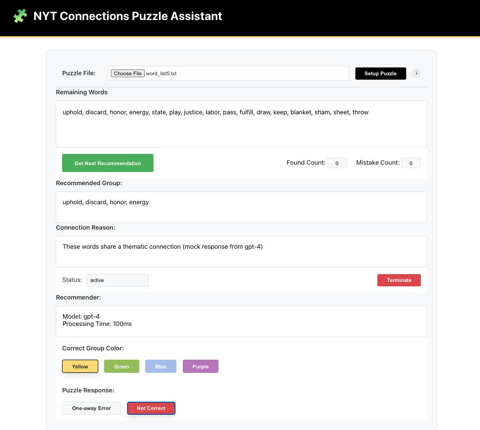

## THANK YOU TROY!
Thank you to [T. Larson](https://github.com/troylar) for his [PR](https://github.com/jimthompson5802/sdd_connection_solver/pull/1) that fixed the frontend issues.  At least I can get a puzzle loaded and see the mock LLM responses.  Now to focus on the LLM integration.

## Here is the initial working web page:
