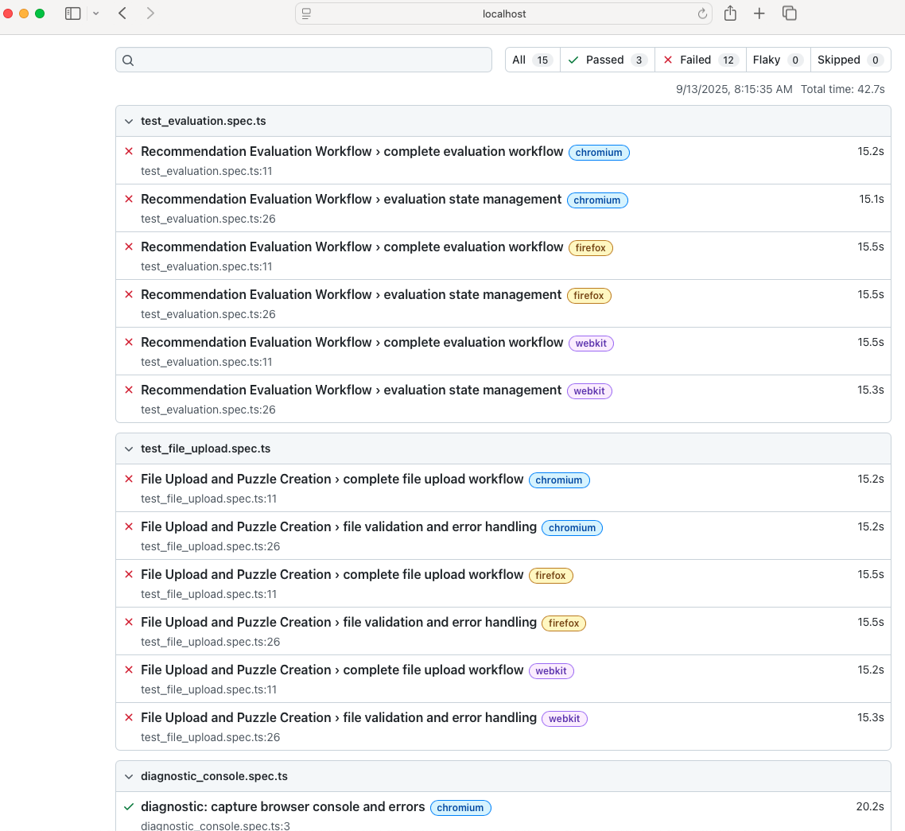

## Frontend Test Status Overivew

```shell
((venv) ) Mac:jim backend[501]$ cd ../frontend
((venv) ) Mac:jim frontend[502]$ npm test

> nyt-connections-puzzle-assistant@1.0.0 test
> jest

 PASS  tests/unit/fileupload.spec.ts
 PASS  tests/unit/recommendationcard.spec.ts
 PASS  tests/unit/gamestate.spec.ts
 PASS  tests/unit/evaluationbuttons.spec.ts
 PASS  tests/unit/puzzleview.spec.ts

Test Suites: 5 passed, 5 total
Tests:       5 passed, 5 total
Snapshots:   0 total
Time:        2.775 s
Ran all test suites.
```

## Playwright Test Status Overview


```shell

> nyt-connections-puzzle-assistant@1.0.0 test:e2e
> playwright test


Running 15 tests using 8 workers

      1 [chromium] › tests/e2e/test_evaluation.spec.ts:11:7 › Recommendation Evaluation Workflow › complete evaluation workflow
      2 [firefox] › tests/e2e/test_evaluation.spec.ts:26:7 › Recommendation Evaluation Workflow › evaluation state management
      3 [chromium] › tests/e2e/test_evaluation.spec.ts:26:7 › Recommendation Evaluation Workflow › evaluation state management
      4 [firefox] › tests/e2e/diagnostic_console.spec.ts:3:5 › diagnostic: capture browser console and errors
      5 [firefox] › tests/e2e/test_evaluation.spec.ts:11:7 › Recommendation Evaluation Workflow › complete evaluation workflow
      6 [chromium] › tests/e2e/test_file_upload.spec.ts:11:7 › File Upload and Puzzle Creation › complete file upload workflow
      7 [chromium] › tests/e2e/test_file_upload.spec.ts:26:7 › File Upload and Puzzle Creation › file validation and error handling
      8 [chromium] › tests/e2e/diagnostic_console.spec.ts:3:5 › diagnostic: capture browser console and errors
Starting diagnostic run: attaching listeners
[response 404] http://localhost:8080/styles.css
[browser console] error Failed to load resource: the server responded with a status of 404 (File not found) http://localhost:8080/styles.css:
[request failed] GET http://localhost:8080/styles.css - net::ERR_ABORTED
[response 404] http://localhost:8080/main.js
[browser console] error Failed to load resource: the server responded with a status of 404 (File not found) http://localhost:8080/main.js:
[request failed] GET http://localhost:8080/main.js - net::ERR_ABORTED
[browser console] log DOM content loaded - initializing app... http://localhost:8080/main.d289db733fc9149d33f5.js:
[browser console] log NYT Connections Puzzle Assistant - Starting Full Application... http://localhost:8080/main.d289db733fc9149d33f5.js:
[browser console] log [App] Initializing NYT Connections Puzzle Assistant... http://localhost:8080/main.d289db733fc9149d33f5.js:
[browser console] log [App] Initializing UI components... http://localhost:8080/main.d289db733fc9149d33f5.js:
[browser console] log [App] Application initialized successfully http://localhost:8080/main.d289db733fc9149d33f5.js:
[browser console] log Application initialized successfully with all components http://localhost:8080/main.d289db733fc9149d33f5.js:
Navigated to /, waiting 20s to capture console output...
Starting diagnostic run: attaching listeners
[response 404] http://localhost:8080/styles.css
[response 404] http://localhost:8080/main.js
[request failed] GET http://localhost:8080/main.js - NS_ERROR_CORRUPTED_CONTENT
[browser console] error [JavaScript Error: "Loading module from “http://localhost:8080/main.js” was blocked because of a disallowed MIME type (“text/html”)." {file: "http://localhost:8080/" line: 0}] http://localhost:8080/:
[browser console] warning [JavaScript Warning: "Loading failed for the module with source “http://localhost:8080/main.js”." {file: "http://localhost:8080/" line: 1}] http://localhost:8080/:1
[browser console] log DOM content loaded - initializing app... http://localhost:8080/main.d289db733fc9149d33f5.js:
[browser console] log NYT Connections Puzzle Assistant - Starting Full Application... http://localhost:8080/main.d289db733fc9149d33f5.js:
  ✘  13 [webkit] › tests/e2e/test_evaluation.spec.ts:26:7 › Recommendation Evaluation Workflow › evaluation state management (15.3s)
[browser console] log [App] Initializing UI components... http://localhost:8080/main.d289db733fc9149d33f5.js:
[browser console] log [App] Application initialized successfully http://localhost:8080/main.d289db733fc9149d33f5.js:
[browser console] log Application initialized successfully with all components http://localhost:8080/main.d289db733fc9149d33f5.js:
Navigated to /, waiting 20s to capture console output...
  ✘   3 [chromium] › tests/e2e/test_evaluation.spec.ts:26:7 › Recommendation Evaluation Workflow › evaluation state management (15.2s)
  ✘   7 [chromium] › tests/e2e/test_file_upload.spec.ts:26:7 › File Upload and Puzzle Creation › file validation and error handling (15.2s)
  ✘  14 [webkit] › tests/e2e/test_file_upload.spec.ts:11:7 › File Upload and Puzzle Creation › complete file upload workflow (15.2s)
  ✘   6 [chromium] › tests/e2e/test_file_upload.spec.ts:11:7 › File Upload and Puzzle Creation › complete file upload workflow (15.2s)
      9 [webkit] › tests/e2e/test_evaluation.spec.ts:11:7 › Recommendation Evaluation Workflow › complete evaluation workflow
     10 [firefox] › tests/e2e/test_file_upload.spec.ts:11:7 › File Upload and Puzzle Creation › complete file upload workflow
     11 [firefox] › tests/e2e/test_file_upload.spec.ts:26:7 › File Upload and Puzzle Creation › file validation and error handling
     12 [webkit] › tests/e2e/diagnostic_console.spec.ts:3:5 › diagnostic: capture browser console and errors
  ✘   5 [firefox] › tests/e2e/test_evaluation.spec.ts:11:7 › Recommendation Evaluation Workflow › complete evaluation workflow (15.5s)
Starting diagnostic run: attaching listeners
[response 404] http://localhost:8080/styles.css
[browser console] error Failed to load resource: the server responded with a status of 404 (File not found) http://localhost:8080/styles.css:
[request failed] GET http://localhost:8080/styles.css - cancelled
[response 404] http://localhost:8080/main.js
[browser console] error Failed to load resource: the server responded with a status of 404 (File not found) http://localhost:8080/main.js:
[request failed] GET http://localhost:8080/main.js - cancelled
[browser console] log DOM content loaded - initializing app... http://localhost:8080/main.d289db733fc9149d33f5.js:
[browser console] log NYT Connections Puzzle Assistant - Starting Full Application... http://localhost:8080/main.d289db733fc9149d33f5.js:
[browser console] log [App] Initializing NYT Connections Puzzle Assistant... http://localhost:8080/main.d289db733fc9149d33f5.js:
[browser console] log [App] Initializing UI components... http://localhost:8080/main.d289db733fc9149d33f5.js:
Navigated to /, waiting 20s to capture console output...
[browser console] log [App] Application initialized successfully http://localhost:8080/main.d289db733fc9149d33f5.js:
  ✘  15 [webkit] › tests/e2e/test_file_upload.spec.ts:26:7 › File Upload and Puzzle Creation › file validation and error handling (15.2s)
  ✘   2 [firefox] › tests/e2e/test_evaluation.spec.ts:26:7 › Recommendation Evaluation Workflow › evaluation state management (15.5s)
     13 [webkit] › tests/e2e/test_evaluation.spec.ts:26:7 › Recommendation Evaluation Workflow › evaluation state management
     14 [webkit] › tests/e2e/test_file_upload.spec.ts:11:7 › File Upload and Puzzle Creation › complete file upload workflow
Diagnostic run complete
  ✓   8 [chromium] › tests/e2e/diagnostic_console.spec.ts:3:5 › diagnostic: capture browser console and errors (20.1s)
     15 [webkit] › tests/e2e/test_file_upload.spec.ts:26:7 › File Upload and Puzzle Creation › file validation and error handling
Diagnostic run complete
  ✓   4 [firefox] › tests/e2e/diagnostic_console.spec.ts:3:5 › diagnostic: capture browser console and errors (20.5s)
  ✘   9 [webkit] › tests/e2e/test_evaluation.spec.ts:11:7 › Recommendation Evaluation Workflow › complete evaluation workflow (15.4s)
  ✘  10 [firefox] › tests/e2e/test_file_upload.spec.ts:11:7 › File Upload and Puzzle Creation › complete file upload workflow (15.5s)
  ✘  11 [firefox] › tests/e2e/test_file_upload.spec.ts:26:7 › File Upload and Puzzle Creation › file validation and error handling (15.5s)
Diagnostic run complete
  ✓  12 [webkit] › tests/e2e/diagnostic_console.spec.ts:3:5 › diagnostic: capture browser console and errors (20.4s)

  12 failed
    [chromium] › tests/e2e/test_evaluation.spec.ts:11:7 › Recommendation Evaluation Workflow › complete evaluation workflow 
    [chromium] › tests/e2e/test_evaluation.spec.ts:26:7 › Recommendation Evaluation Workflow › evaluation state management 
    [chromium] › tests/e2e/test_file_upload.spec.ts:11:7 › File Upload and Puzzle Creation › complete file upload workflow 
    [chromium] › tests/e2e/test_file_upload.spec.ts:26:7 › File Upload and Puzzle Creation › file validation and error handling 
    [firefox] › tests/e2e/test_evaluation.spec.ts:11:7 › Recommendation Evaluation Workflow › complete evaluation workflow 
    [firefox] › tests/e2e/test_evaluation.spec.ts:26:7 › Recommendation Evaluation Workflow › evaluation state management 
    [firefox] › tests/e2e/test_file_upload.spec.ts:11:7 › File Upload and Puzzle Creation › complete file upload workflow 
    [firefox] › tests/e2e/test_file_upload.spec.ts:26:7 › File Upload and Puzzle Creation › file validation and error handling 
    [webkit] › tests/e2e/test_evaluation.spec.ts:11:7 › Recommendation Evaluation Workflow › complete evaluation workflow 
    [webkit] › tests/e2e/test_evaluation.spec.ts:26:7 › Recommendation Evaluation Workflow › evaluation state management 
    [webkit] › tests/e2e/test_file_upload.spec.ts:11:7 › File Upload and Puzzle Creation › complete file upload workflow 
    [webkit] › tests/e2e/test_file_upload.spec.ts:26:7 › File Upload and Puzzle Creation › file validation and error handling 
  3 passed (41.4s)
```

## Backend Test Status Overview
```shell
source /Users/jim/Desktop/genai/sdd_connection_solver/venv/bin/activate
Mac:jim sdd_connection_solver[497]$ source /Users/jim/Desktop/genai/sdd_connection_solver/venv/bin/activate
((venv) ) Mac:jim sdd_connection_solver[498]$ pytest -q backend/tests
================================================================== test session starts ===================================================================
platform darwin -- Python 3.12.11, pytest-8.4.2, pluggy-1.6.0
rootdir: /Users/jim/Desktop/genai/sdd_connection_solver/backend
configfile: pyproject.toml
plugins: asyncio-1.1.0, mock-3.15.0, anyio-4.10.0, langsmith-0.4.27
asyncio: mode=Mode.AUTO, asyncio_default_fixture_loop_scope=None, asyncio_default_test_loop_scope=function
collected 215 items                                                                                                                                      

backend/tests/contract/test_history.py ..F.FFF..                                                                                                   [  4%]
backend/tests/contract/test_puzzles_get.py .........                                                                                               [  8%]
backend/tests/contract/test_puzzles_upload.py ..........                                                                                           [ 13%]
backend/tests/contract/test_recommendations_create.py ...........                                                                                  [ 18%]
backend/tests/contract/test_recommendations_evaluate.py ............                                                                               [ 23%]
backend/tests/contract/test_recommendations_get.py ...........                                                                                     [ 28%]
backend/tests/contract/test_sessions_create.py ...........                                                                                         [ 33%]
backend/tests/contract/test_sessions_get.py ...FFF......                                                                                           [ 39%]
backend/tests/integration/test_ai_recommendations.py FF                                                                                            [ 40%]
backend/tests/integration/test_complete_game.py F                                                                                                  [ 40%]
backend/tests/integration/test_evaluation_flow.py F                                                                                                [ 41%]
backend/tests/integration/test_puzzle_upload_flow.py ...F.                                                                                         [ 43%]
backend/tests/integration/test_session_creation.py ...                                                                                             [ 45%]
backend/tests/performance/test_api_response_times.py .FF.FF.........EEE                                                                            [ 53%]
backend/tests/performance/test_recommendation_timing.py ..........F                                                                                [ 58%]
backend/tests/performance/test_websocket_capacity.py ..........                                                                                    [ 63%]
backend/tests/unit/test_context_service.py ............................                                                                            [ 76%]
backend/tests/unit/test_evaluation_logic.py ...F......F.......F.                                                                                   [ 85%]
backend/tests/unit/test_prompt_generation.py ..........FFFFFFFF.F...FFFF..FF                                                                       [100%]

================================================================ short test summary info =================================================================
FAILED backend/tests/contract/test_history.py::TestHistoryContract::test_get_history_empty_session - AssertionError: assert 2 == 0
FAILED backend/tests/contract/test_history.py::TestHistoryContract::test_get_history_invalid_session_uuid - AssertionError: Expected 400, got 404
FAILED backend/tests/contract/test_history.py::TestHistoryContract::test_get_history_summary_calculations - assert 404 == 200
FAILED backend/tests/contract/test_history.py::TestHistoryContract::test_get_history_recommendation_uniqueness - assert 404 == 200
FAILED backend/tests/contract/test_sessions_get.py::TestSessionsGetContract::test_get_session_active_status - assert 404 == 200
FAILED backend/tests/contract/test_sessions_get.py::TestSessionsGetContract::test_get_session_completed_status - assert 404 == 200
FAILED backend/tests/contract/test_sessions_get.py::TestSessionsGetContract::test_get_session_failed_status - assert 400 == 200
FAILED backend/tests/integration/test_ai_recommendations.py::TestAIRecommendationsIntegration::test_complete_recommendation_workflow - AssertionError: AI recommendation integration not implemented
FAILED backend/tests/integration/test_ai_recommendations.py::TestAIRecommendationsIntegration::test_context_aware_recommendations - AssertionError: Context-aware recommendation logic not implemented
FAILED backend/tests/integration/test_complete_game.py::TestCompleteGameIntegration::test_complete_game_session_workflow - AssertionError: Complete game workflow integration not implemented
FAILED backend/tests/integration/test_evaluation_flow.py::TestEvaluationFlowIntegration::test_complete_evaluation_workflow - AssertionError: Evaluation workflow integration not implemented
FAILED backend/tests/integration/test_puzzle_upload_flow.py::TestPuzzleUploadFlowIntegration::test_puzzle_upload_duplicate_detection - assert 'duplicate' in '{\'error\': \'validation_error\', \'message\': "1 validation error for puzzle\\nwords\\n  value error, all words must...\', \'...
FAILED backend/tests/performance/test_api_response_times.py::TestAPIResponseTimes::test_puzzle_get_response_time - assert 400 == 200
FAILED backend/tests/performance/test_api_response_times.py::TestAPIResponseTimes::test_session_create_response_time - assert 400 == 201
FAILED backend/tests/performance/test_api_response_times.py::TestAPIResponseTimes::test_history_get_response_time - pydantic_core._pydantic_core.ValidationError: 1 validation error for Session
FAILED backend/tests/performance/test_api_response_times.py::TestAPIResponseTimes::test_recommendations_get_response_time - pydantic_core._pydantic_core.ValidationError: 1 validation error for Session
FAILED backend/tests/performance/test_recommendation_timing.py::TestPerformanceEdgeCases::test_maximum_context_timing - pydantic_core._pydantic_core.ValidationError: 2 validation errors for AIRecommendationContext
FAILED backend/tests/unit/test_evaluation_logic.py::TestEvaluationService::test_evaluate_recommendation_one_away - pydantic_core._pydantic_core.ValidationError: 2 validation errors for OneAwayGroup
FAILED backend/tests/unit/test_evaluation_logic.py::TestEvaluationService::test_analyze_learning_patterns_improvement - assert False
FAILED backend/tests/unit/test_evaluation_logic.py::TestEvaluationService::test_evaluation_with_existing_solved_groups - AttributeError: 'Group' object has no attribute 'position'
FAILED backend/tests/unit/test_prompt_generation.py::TestPromptTemplateManager::test_generate_prompt_success - pydantic_core._pydantic_core.ValidationError: 1 validation error for AIRecommendationContext
FAILED backend/tests/unit/test_prompt_generation.py::TestPromptTemplateManager::test_generate_prompt_template_not_found - pydantic_core._pydantic_core.ValidationError: 1 validation error for AIRecommendationContext
FAILED backend/tests/unit/test_prompt_generation.py::TestPromptTemplateManager::test_select_template_initial - pydantic_core._pydantic_core.ValidationError: 1 validation error for AIRecommendationContext
FAILED backend/tests/unit/test_prompt_generation.py::TestPromptTemplateManager::test_select_template_context_aware - pydantic_core._pydantic_core.ValidationError: 1 validation error for AIRecommendationContext
FAILED backend/tests/unit/test_prompt_generation.py::TestPromptTemplateManager::test_select_template_one_away_focused - pydantic_core._pydantic_core.ValidationError: 2 validation errors for AIRecommendationContext
FAILED backend/tests/unit/test_prompt_generation.py::TestPromptTemplateManager::test_select_template_final_attempt - pydantic_core._pydantic_core.ValidationError: 1 validation error for AIRecommendationContext
FAILED backend/tests/unit/test_prompt_generation.py::TestPromptTemplateManager::test_build_context_variables_minimal - pydantic_core._pydantic_core.ValidationError: 1 validation error for AIRecommendationContext
FAILED backend/tests/unit/test_prompt_generation.py::TestPromptTemplateManager::test_build_context_variables_full - pydantic_core._pydantic_core.ValidationError: 2 validation errors for AIRecommendationContext
FAILED backend/tests/unit/test_prompt_generation.py::TestPromptTemplateManager::test_format_solved_groups_multiple - pydantic_core._pydantic_core.ValidationError: 1 validation error for Group
FAILED backend/tests/unit/test_prompt_generation.py::TestPromptTemplateManager::test_format_one_away_attempts_multiple - AttributeError: 'OneAwayGroup' object has no attribute 'attempted_words'
FAILED backend/tests/unit/test_prompt_generation.py::TestPromptGeneration::test_get_prompt_for_context_auto_select - pydantic_core._pydantic_core.ValidationError: 1 validation error for AIRecommendationContext
FAILED backend/tests/unit/test_prompt_generation.py::TestPromptGeneration::test_get_prompt_for_context_specific_template - pydantic_core._pydantic_core.ValidationError: 1 validation error for AIRecommendationContext
FAILED backend/tests/unit/test_prompt_generation.py::TestPromptGeneration::test_get_prompt_for_context_extra_context - pydantic_core._pydantic_core.ValidationError: 1 validation error for AIRecommendationContext
FAILED backend/tests/unit/test_prompt_generation.py::TestPromptGeneration::test_template_variable_consistency - pydantic_core._pydantic_core.ValidationError: 2 validation errors for AIRecommendationContext
FAILED backend/tests/unit/test_prompt_generation.py::TestPromptGeneration::test_template_context_sensitivity - pydantic_core._pydantic_core.ValidationError: 1 validation error for AIRecommendationContext
ERROR backend/tests/performance/test_api_response_times.py::TestMemoryEfficiency::test_path_parameter_processing
ERROR backend/tests/performance/test_api_response_times.py::TestMemoryEfficiency::test_query_parameter_processing
ERROR backend/tests/performance/test_api_response_times.py::TestMemoryEfficiency::test_json_payload_processing
================================================= 35 failed, 177 passed, 96 warnings, 3 errors in 8.15s ==================================================
((venv) ) Mac:jim sdd_connection_solver[499]$ 
```

